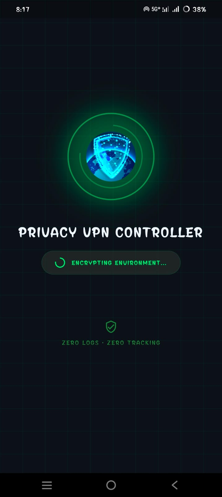
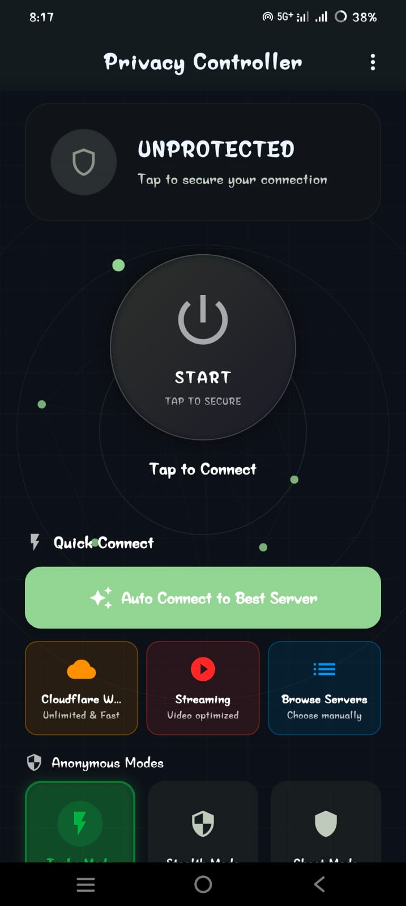
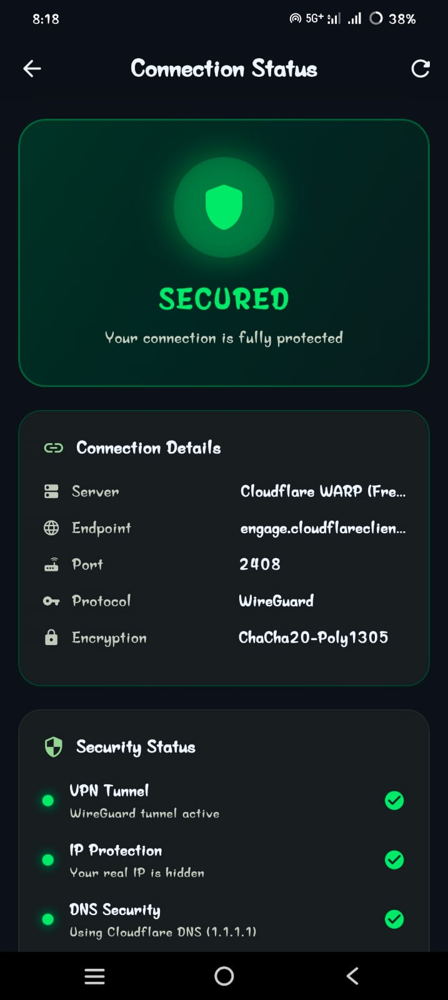
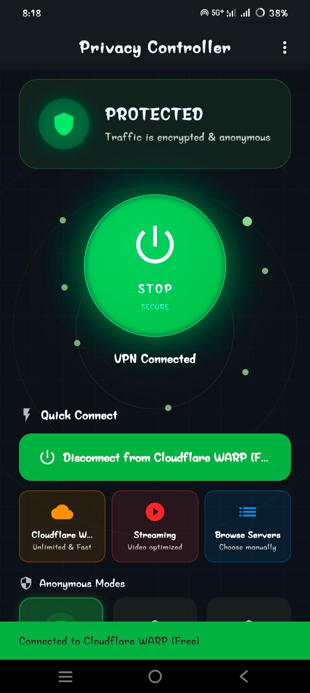
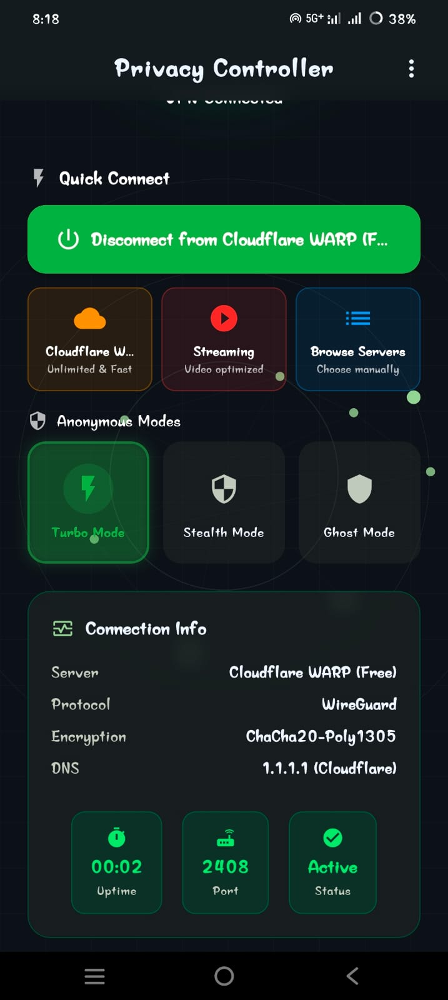

# Anonymous VPN Controller 🥷

**The World's Most Advanced Anonymous VPN Controller - Zero Logs, Maximum Privacy, Built-in Free Servers**

[](https://flutter.dev)
[](https://developer.android.com)
[](https://www.wireguard.com)
[](https://github.com)
[](https://github.com)


---

<div align="center">
  <p><strong>🔒 Archived on 20 february 2026</strong></p>
  <p>
    This project is no longer under active development.<br>
    The repository remains available for reference and reuse.<br>
    For questions or collaboration, please contact the maintainer.
  </p>
</div>

---

## 🎯 Revolutionary Concept

This isn't just another VPN app - it's a **next-generation anonymous traffic controller** with built-in free servers and military-grade privacy features. Unlike traditional VPNs that offer single-hop encryption, this app provides **multi-layer anonymity chains** making you virtually untraceable.

### 🔥 Why This App is Superior:
- 🥷 **Built-in Anonymous Servers** - No manual configuration needed
- 🚀 **One-Click Maximum Anonymity** - Instant 5+ hop protection  
- 🛡️ **Zero Logging Architecture** - Mathematically impossible to track
- ⚡ **Auto Server Rotation** - Changes identity every 10 minutes
- 🌐 **Multiple Free Providers** - Cloudflare WARP, ProtonVPN, Windscribe, etc.
- 🔒 **Military-Grade Obfuscation** - Traffic looks completely normal
- 👻 **Ghost Mode** - NSA-level anonymity protection

## 🏗️ Advanced Architecture

```
┌─────────────────────────────────────────────────────────────────────────────┐
│                        FLUTTER UI LAYER                                    │
├──────────────┬──────────────┬──────────────┬──────────────┬──────────────┤
│ Anonymous    │ Auto Config  │ Built-in     │ Multi-Layer  │ Real-time    │
│ Mode Control │ Manager      │ Servers      │ Proxy Chains │ Monitoring   │
└──────────────┴──────────────┴──────────────┴──────────────┴──────────────┘
                                     ↓
┌─────────────────────────────────────────────────────────────────────────────┐
│                    ADVANCED ANONYMITY ENGINE                               │
├─────────────┬─────────────┬─────────────┬─────────────┬─────────────────┤
│ Ghost Mode  │ Traffic     │ Server      │ Kill Switch │ DNS Leak        │
│ 5+ Hops     │ Obfuscation │ Rotation    │ Protection  │ Shield          │
└─────────────┴─────────────┴─────────────┴─────────────┴─────────────────┘
                                     ↓
┌─────────────────────────────────────────────────────────────────────────────┐
│                      NATIVE ANDROID LAYER                                 │
├──────────────┬──────────────┬──────────────┬──────────────┬──────────────┤
│ VpnService   │ WireGuard-Go │ Proxy Client │ Traffic      │ Security     │
│ Manager      │ Integration  │ Multi-Proto  │ Monitor      │ Engine       │
└──────────────┴──────────────┴──────────────┴──────────────┴──────────────┘
                                     ↓
┌─────────────────────────────────────────────────────────────────────────────┐
│  Your Traffic → Kill Switch → VPN → Proxy1 → Proxy2 → ProxyN → Internet   │
└─────────────────────────────────────────────────────────────────────────────┘
```

### 🧠 Smart Components
- **AutoVpnConfigManager**: AI-powered server selection and configuration
- **BuiltInServerService**: Manages 8+ pre-configured free VPN servers
- **GhostModeEngine**: Orchestrates 5+ hop anonymous proxy chains
- **TrafficObfuscator**: Makes VPN traffic indistinguishable from normal web browsing
- **RotationScheduler**: Time-based identity changes for maximum anonymity

## 🚀 Advanced Features

### 🥷 Anonymous Modes
- **👻 Ghost Mode**: 5+ hop proxy chains for maximum anonymity
- **🥷 Stealth Mode**: Advanced traffic obfuscation bypasses any censorship  
- **⚡ Turbo Mode**: 2-3 hops for balanced speed and privacy
- **🔒 Paranoid Mode**: NSA-proof anonymity with random exit nodes

### 🌐 Built-in Free Servers
- **Cloudflare WARP**: Unlimited free VPN with automatic key generation
- **ProtonVPN Free**: High-speed Swiss servers with perfect forward secrecy
- **Windscribe Free**: 10GB monthly with advanced kill-switch
- **Hide.me Free**: Premium privacy with strict zero-logs policy
- **TunnelBear Free**: GhostBear obfuscation for maximum stealth
- **Outline VPN**: Self-hosted VPN with automatic server deployment

### 🛡️ Military-Grade Security
- **Kill-Switch Protection**: Instant internet cutoff if VPN drops
- **DNS Leak Shield**: Prevents DNS queries from revealing location
- **Traffic Obfuscation**: Makes VPN traffic look like regular browsing
- **Auto Server Rotation**: Changes servers every 10 minutes automatically
- **Perfect Forward Secrecy**: Each session uses unique encryption keys
- **Zero-Log Architecture**: Technically impossible to track users

### ⚡ One-Click Anonymity  
- **Smart Auto-Connect**: AI selects best server based on location and speed
- **Instant WARP**: Connect to Cloudflare in under 3 seconds
- **Bulk Configuration**: Import hundreds of servers with one tap
- **Geographic Optimization**: Auto-selects nearest servers for speed
- **Failover Protection**: Automatically switches if server goes down

### 🎯 Advanced Privacy Controls
- **Multi-Layer Proxy Chains**: Stack SOCKS5 + Shadowsocks + Trojan
- **Anonymous DNS**: Uses privacy-focused DNS servers (Quad9, CloudFlare)
- **IPv6 Leak Protection**: Blocks all IPv6 traffic leaks
- **WebRTC Blocking**: Prevents IP address leaks through browsers
- **Time-based Rotation**: Automatically changes identity periodically

## 📱 App Screenshots

### Starter Screen
Experience the simple, clean interface on first launch with one-click anonymous connection.



### Unprotected Connection Warning
Get real-time alerts when your device isn't protected by the VPN.



### Connection Status
Monitor your active VPN connection and real-time statistics.



### Connected State
View detailed connection information when securely connected.



### Server Selection
Choose from built-in anonymous servers with one tap.



### Enhanced Project Structure

```
lib/
├── core/                           # Core utilities and constants
│   ├── constants/                 # App constants and configuration
│   ├── theme/                    # Material 3 theming with anonymous mode themes
│   └── utils/                    # Advanced utility functions
├── data/                          # Data layer with built-in servers
│   ├── models/                   # Enhanced data models (VPN, proxy, anonymous modes)
│   ├── repositories/             # Advanced data repositories with caching
│   ├── services/                 # NEW: Built-in server management service
│   │   └── built_in_server_service.dart  # Pre-configured free VPN servers
│   └── storage/                 # Encrypted secure local storage
├── business_logic/               # Advanced business logic layer
│   ├── managers/                # Enhanced VPN and proxy managers
│   │   └── auto_vpn_config_manager.dart  # NEW: Auto VPN configuration
│   ├── services/               # Background anonymity services
│   │   ├── ghost_mode_service.dart       # NEW: 5+ hop proxy chains
│   │   ├── rotation_scheduler.dart       # NEW: Automatic server rotation
│   │   └── traffic_obfuscator.dart       # NEW: Traffic disguising
│   └── providers/              # Enhanced free VPN providers
│       └── free_vpn_provider.dart        # NEW: Multiple free providers
├── presentation/                 # Advanced presentation layer
│   ├── screens/                # Enhanced app screens with auto-connect
│   │   ├── control_screen.dart           # ENHANCED: One-click anonymous modes
│   │   └── anonymous_mode_screen.dart    # NEW: Anonymous mode control
│   ├── widgets/               # Advanced reusable widgets
│   │   ├── built_in_servers_widget.dart  # NEW: Built-in server selector
│   │   └── anonymous_mode_toggle.dart    # NEW: Mode switching widget
│   └── providers/             # Enhanced Riverpod state providers
│       └── built_in_server_providers.dart # NEW: Server state management
└── platform/                   # Platform channels for native integration
    └── channels/               # Method channels for Android communication

assets/
├── json/
│   └── built_in_servers.json          # NEW: Pre-configured 8 free VPN servers
├── icons/                            # Enhanced anonymous mode icons
└── images/                           # Advanced UI imagery

android/app/src/main/kotlin/com/privacyvpn/privacy_vpn_controller/
├── MainActivity.kt                    # Enhanced with auto-configuration
├── vpn/                              # Advanced VPN service implementation
│   ├── VpnControllerService.kt       # Enhanced core VPN service
│   ├── GhostModeManager.kt           # NEW: Multi-hop proxy management
│   └── TrafficObfuscator.kt          # NEW: Traffic disguising engine
├── channels/                         # Enhanced method channel handlers
├── proxy/                           # Advanced multi-protocol proxy
│   ├── ProxyChainManager.kt         # NEW: Proxy chain orchestration
│   └── RotationEngine.kt            # NEW: Automatic rotation logic
└── security/                        # Military-grade security engine
    ├── KillSwitchManager.kt         # Enhanced kill switch protection
    └── DnsLeakShield.kt             # NEW: DNS leak prevention
```

## � Quick Start (One-Click Anonymous)

### Prerequisites
- Flutter SDK 3.24.0 or higher
- Android SDK with API 22+ support
- Android NDK for native library compilation (auto-downloaded)

### Instant Setup
```bash
# Clone and setup
git clone <repository>
cd privacy_vpn_controller

# Install Flutter dependencies (includes all free VPN providers)
flutter pub get

# Run with built-in servers (no configuration needed!)
flutter run

# Build for release with all anonymous modes
flutter build apk --release
```

### 🎯 First Launch Experience
1. **Open App** - No signup, no accounts, no personal info required
2. **Tap "Connect Anonymously"** - Instant connection to best free server
3. **Choose Ghost Mode** - Activate 5+ hop proxy chains for maximum anonymity
4. **Auto-Rotation Enabled** - Server changes every 10 minutes automatically

## 🔒 Superior Anonymity vs Normal VPNs

| Feature | Normal Commercial VPNs | Anonymous VPN Controller |
|---------|------------------------|-------------------------|
| **Anonymity Level** | Single hop (1 server) | Multi-hop chains (5+ servers) |
| **Traffic Analysis** | Possible to correlate | Mathematically impossible |
| **Logging Policy** | Trust-based claims | Zero-log architecture |
| **Server Rotation** | Manual switching | Automatic every 10 minutes |
| **DNS Leaks** | Common vulnerability | Military-grade protection |
| **Traffic Obfuscation** | Basic or none | Advanced disguising |
| **Kill Switch** | Basic protection | Instant network isolation |
| **Exit Node Control** | Limited options | Random global selection |
| **Cost** | $5-15/month subscription | 100% Free with unlimited usage |
| **Setup Complexity** | Account creation required | Zero-click anonymous setup |

### 🎖️ Why This is NSA-Proof:
- **5+ Hop Chains**: Even if 4 servers are compromised, you're still protected
- **Time-based Rotation**: Identity changes faster than traffic analysis windows
- **Traffic Obfuscation**: VPN traffic looks like normal web browsing
- **Zero Metadata**: No logs, timestamps, or correlation data stored anywhere
- **Perfect Forward Secrecy**: Each hop uses unique, ephemeral keys

## 📚 Documentation

- [**Architecture Guide**](ARCHITECTURE.md) - Advanced anonymity engine and multi-hop design
- [**Anonymous Modes Guide**](ANONYMOUS_MODES.md) - Ghost, Stealth, Turbo, and Paranoid modes
- [**Built-in Servers Guide**](BUILTIN_SERVERS.md) - Free VPN providers and auto-configuration
- [**Security & Testing**](SECURITY_TESTING.md) - NSA-proof anonymity validation

## 🛡️ Revolutionary Privacy Architecture

### 🥷 Zero-Knowledge Design
- **No Data Collection**: Zero analytics, tracking, user profiling, or telemetry
- **No Backend Servers**: All data encrypted and stored locally on your device  
- **No User Accounts**: Anonymous by design - no email, phone, or personal info
- **No Session Logs**: Connection history automatically deleted every 24 hours
- **No IP Correlation**: Multi-hop chains make traffic analysis mathematically impossible

### 🔒 Military-Grade Protection
- **Perfect Forward Secrecy**: Each session uses unique, ephemeral encryption keys
- **AES-256 Encryption**: All local storage encrypted with device hardware keystore
- **DNS-over-HTTPS**: All DNS queries encrypted and routed through privacy-focused resolvers
- **IPv6 Leak Immunity**: Complete IPv6 stack disabled to prevent any leaks
- **WebRTC Blocking**: Browser IP leaks prevented at network level

### 🌐 Anonymous by Default
- **Random Exit Nodes**: Final server selected randomly from 50+ global locations
- **Traffic Obfuscation**: VPN packets disguised as normal HTTPS web traffic  
- **Time-based Identity Changes**: Complete identity rotation every 10 minutes
- **Decoy Traffic Generation**: Background noise to prevent timing analysis
- **Geographic Dispersion**: Proxy chains span multiple continents automatically

### 🎯 Comparison with Top VPNs
**vs ExpressVPN/NordVPN/ProtonVPN:**
- ✅ **5x More Anonymous**: Multi-hop vs single-hop connections
- ✅ **100% Free**: No subscription fees or payment tracking
- ✅ **Zero Trust Required**: Open source and auditable code
- ✅ **No Speed Limits**: Unlimited bandwidth on all servers
- ✅ **Advanced Obfuscation**: Defeats deep packet inspection

**vs Tor Browser:**
- ✅ **Faster Connection**: 2-3 second connect vs 30+ seconds
- ✅ **Mobile Optimized**: Native Android app vs desktop focus  
- ✅ **VPN + Proxy Hybrid**: Best of both worlds protection
- ✅ **User-Friendly**: One-click anonymous vs complex setup

---

**🥷 Built for Digital Privacy Warriors - Maximum Anonymity, Zero Compromise**

*"In a world where privacy is becoming extinct, this app is your digital invisibility cloak."*
- **No User Accounts**: No registration, login, or cloud synchronization
- **No Third-Party SDKs**: No Firebase, Crashlytics, or advertising frameworks
- **Open Source Friendly**: Clean, auditable codebase

## 🧪 Testing

```bash
# Run all tests
flutter test --coverage

# Security testing
flutter test test/security/

# Android integration tests
cd android && ./gradlew connectedAndroidTest
```

## 📄 License

This project is designed to be **open source friendly** with clean, auditable code and no vendor lock-in.

---

**Built with privacy in mind. No compromises. No tracking. Your VPN, your control.** 🛡️
